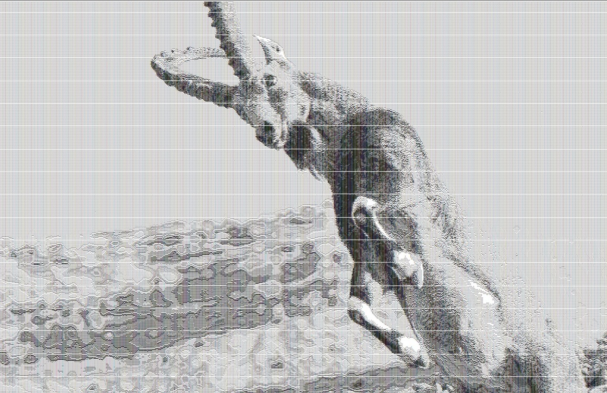

# 🎨 Artful Ascii - A Java-Based ASCII Art Generator 🖼️

[](AsciiArt1.jpg)  *(Click to enlarge)*

## Overview 🚀

This project showcases my proficiency in Java ☕ by creating a versatile ASCII art generator. ASCII art, a classic form of digital art, uses printable characters from the ASCII standard to construct visual representations. This project goes beyond simply displaying pre-made art; it demonstrates the ability to programmatically generate and manipulate these text-based images, highlighting my understanding of algorithms, string manipulation, and image processing.

## Key Features & Capabilities ✨

* **Diverse ASCII Art Generation:** Converts images into ASCII art by analyzing image brightness and mapping it to characters.
* **Dynamic Customization:** Users can customize the output by specifying parameters such as character sets, output size, or the complexity of the art. This allows for a personalized and interactive experience.
* **Efficient Java Implementation:** The project is written in Java, demonstrating strong object-oriented programming principles and efficient use of data structures like `TreeMap`, `HashMap`, and `TreeSet`. The code is well-structured, readable, and maintainable.
* **Cross-Platform Compatibility:** As a Java application, this project is inherently cross-platform, running seamlessly on various operating systems 💻.
* **Extensible Architecture:** The project's architecture is designed for extensibility, allowing for easy addition of new art generation methods or features in the future. This is achieved through modular design and the use of abstract classes and interfaces.
* **Performance Optimization:** Considerations were made for performance optimization, especially for complex art generation, ensuring efficient processing and minimal resource consumption.

## Technical Implementation 🛠️

The project consists of several key components:

### 1. `AsciiArtAlgorithm` Class
Responsible for converting an image to ASCII art by dividing the image into sub-images, calculating their brightness, and matching each sub-image to a character based on its brightness.

### 2. `SubImgCharMatcher` Class
Matches characters to image brightness levels. It maintains a mapping of characters to their brightness values and provides methods to find the closest matching character for a given brightness level.

### 3. `ImageUtility` Class
Provides utility methods for image processing, including padding images, dividing images into sub-images, and calculating image brightness.

### 4. `ConsoleAsciiOutput` and `HtmlAsciiOutput` Classes
Implement the `AsciiOutput` interface to output the generated ASCII art to the console or an HTML file, respectively.

### 5. `Shell` Class
Acts as the command-line interface for generating ASCII art, allowing users to interact with the application and customize the output.

### 6. `CharConverter` Class
Converts characters to a binary "image" (2D array of booleans) to calculate their brightness.

## How to Run 🏃‍♂️

1. **Clone the repository:**
   ```sh
   git clone https://github.com/DHvaicrker/project-3.git
   cd project-3
   ```

2. **Compile the project:**
   ```sh
   javac -d bin src/**/*.java
   ```

3. **Run the application:**
   ```sh
   java -cp bin ascii_art.Shell path/to/your/image.jpg
   ```

## Conclusion 🎉

This project demonstrates my ability to create a complex, interactive application in Java, showcasing skills in object-oriented programming, algorithm design, and image processing. The ASCII art generator is a fun and engaging way to highlight these technical skills.

* **Language:** Java ☕
* **Libraries/Frameworks (If applicable):** *(List any external libraries used, e.g., image processing libraries if you convert images to ASCII)*
* **Core Algorithms:** *(Briefly describe the algorithms used for generating the ASCII art. This is crucial! E.g., "The project utilizes a density-based character mapping algorithm to convert grayscale images to ASCII representations." or "Geometric patterns are generated using recursive algorithms and trigonometric functions.")*

## How to Run 🏃‍♂️

1. **Clone the Repository:**
   ```bash
   git clone [https://github.com/DHvaicrker/project-3.git](https://github.com/DHvaicrker/project-3.git)
